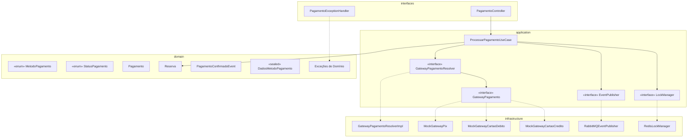

# Feature: Pagamento de Ingresso

Implementar o fluxo de pagamento de ingressos no TicketScale, seguindo Clean Architecture, SOLID e DDD, com suporte a **3 métodos de pagamento**: **Pix**, **Cartão de Débito** e **Cartão de Crédito**. O design central combina **inversão de dependência (DIP)** com **Strategy pattern**: a camada `application` define uma **porta (interface)** `GatewayPagamento`, e um `GatewayPagamentoResolver` seleciona a estratégia correta. A camada `infrastructure` fornece implementações **mock** para cada método (testes/dev) e, futuramente, integrações reais.

---

## Avaliação do Plano Original

> [!NOTE]
> O plano original apresentava uma boa visão geral, mas continha **10 problemas** que violam Clean Code, DDD, SOLID, DRY e KISS. As correções estão incorporadas neste documento revisado.

| # | Problema Identificado | Princípio Violado | Correção |
|---|---|---|---|
| 1 | `PagamentoRepository extends JpaRepository` no **domain** — acopla domínio ao Spring Data JPA | **DIP / Clean Arch** | Repositório do domínio é interface pura; JPA fica em `infrastructure` (padrão existente em `UsuarioRepository`) |
| 2 | `Pagamento` com `@Entity` e `@ManyToOne` no **domain** — anotações JPA poluem a camada de negócio | **DDD / Clean Arch** | Aceitar como trade-off pragmático (consistente com `Reserva.java`, `Ingresso.java` já existentes), mas documentar a decisão |
| 3 | `SolicitacaoPagamento` com campos nullable (`dadosPix=null` se cartão, `dadosCartao=null` se Pix) — union type improvisado | **KISS / ISP** | Usar `sealed interface DadosMetodoPagamento` com `DadosPix` e `DadosCartao` como records que implementam — elimina nulls e valida por tipo |
| 4 | `GatewayPagamentoResolver` como `@Component` na camada **application** — Spring leak | **Clean Arch** | `GatewayPagamentoResolver` deve ser uma interface/porta na application; a implementação com `@Component` fica em `infrastructure` |
| 5 | Falta de **exceções de domínio** — usa `RuntimeException` e `IllegalArgumentException` genéricas | **DDD / Clean Code** | Criar `PagamentoException`, `ReservaNaoEncontradaException`, `MetodoNaoSuportadoException` no domínio |
| 6 | `PagamentoControllerTest` espera `200` para criação de recurso | **REST / Clean Code** | Corrigir para `201 Created` com header `Location` |
| 7 | Falta validação de **idempotência** — pagamento duplicado para mesma reserva | **DDD / Integridade** | Adicionar check `pagamentoRepository.existsByReservaIdAndStatus(reservaId, APROVADO)` antes de processar |
| 8 | Falta **lock distribuído** no `ProcessarPagamentoUseCase` — condição de corrida entre verificação de idempotência e processamento | **Concorrência / Integridade** | Adicionar `LockManager.acquireLock("lock:pagamento:reserva:" + reservaId)` seguindo o padrão do `ReservarIngressoUseCase` |
| 9 | Navegação `reserva → ingresso → lote` com `FetchType.LAZY` causa **N+1 queries** | **Performance** | Criar query `JOIN FETCH` dedicada no `ReservaRepository` para buscar reserva com ingresso e lote em uma única query |
| 10 | Falta mapeamento de **exceções de domínio → HTTP status codes** — sem `@RestControllerAdvice` | **REST / Clean Code** | Criar `PagamentoExceptionHandler` com `@RestControllerAdvice` para traduzir exceções em respostas HTTP adequadas |

---

## Análise do Estado Atual

O domínio já possui os hooks necessários:
- `Reserva.confirmarPagamento()` → muda status para `CONFIRMADA` e chama `ingresso.vender()`
- `Ingresso.vender()` → muda status de `RESERVADO` para `VENDIDO`
- `StatusReserva` → `PENDENTE`, `CONFIRMADA`, `CANCELADA`
- `Lote.getPreco()` → retorna o `BigDecimal` do preço (usado para obter o valor do pagamento)

O que falta é o **caso de uso** que orquestra o pagamento e a **infraestrutura** de gateway.

---

## Arquitetura Proposta (Revisada)



### Princípios Aplicados

| Princípio | Aplicação |
|-----------|-----------|
| **SRP** | Cada gateway cuida apenas do seu método; `Resolver` só seleciona; `UseCase` só orquestra |
| **OCP** | Novo método de pagamento = nova implementação de `GatewayPagamento` + valor no enum, sem alterar use case |
| **LSP** | Qualquer implementação de `GatewayPagamento` é substituível (mock ↔ real) por método |
| **ISP** | `GatewayPagamento` possui interface mínima; cada método define seus dados via `sealed interface` específica |
| **DIP** | Use case depende de abstrações (`GatewayPagamento`, `GatewayPagamentoResolver`), não de implementações |
| **DRY** | `DadosMetodoPagamento` sealed evita duplicação de validação null entre DTO e domínio |
| **KISS** | Sem union-type improvisado; pattern matching no sealed interface é idiomático Java 25 |

---

## Proposed Changes

### Domain Layer

#### [NEW] `MetodoPagamento.java`
**Pacote:** `domain.pagamento`

Enum que define os métodos de pagamento suportados:

```java
public enum MetodoPagamento {
    PIX, CARTAO_DEBITO, CARTAO_CREDITO
}
```

#### [NEW] `StatusPagamento.java`
**Pacote:** `domain.pagamento`

Enum: `PENDENTE`, `APROVADO`, `RECUSADO`, `ESTORNADO`

#### [NEW] `DadosMetodoPagamento.java`
**Pacote:** `domain.pagamento`

Sealed interface que elimina nulls e usa pattern matching do Java 25:

```java
public sealed interface DadosMetodoPagamento
    permits DadosPix, DadosCartao {}

public record DadosPix(String chavePix)
    implements DadosMetodoPagamento {
    public DadosPix {
        if (chavePix == null || chavePix.isBlank()) {
            throw new IllegalArgumentException("Chave Pix é obrigatória.");
        }
    }
}

public record DadosCartao(
    String numeroCartao,
    String nomeTitular,
    String validade,
    String cvv,
    int parcelas
) implements DadosMetodoPagamento {
    public DadosCartao {
        if (numeroCartao == null || numeroCartao.isBlank()) {
            throw new IllegalArgumentException("Número do cartão é obrigatório.");
        }
        if (parcelas < 1) {
            throw new IllegalArgumentException("Parcelas deve ser >= 1.");
        }
    }
}
```

#### [NEW] `Pagamento.java`
**Pacote:** `domain.pagamento`

Entidade de domínio que registra uma tentativa de pagamento:

- **Campos**: `id (UUID)`, `reservaId (UUID)`, `valor (BigDecimal)`, `status (StatusPagamento)`, `metodoPagamento (MetodoPagamento)`, `transacaoExternaId (String)`, `dataCriacao`, `dataAtualizacao`
- **Métodos de negócio**: `confirmar(transacaoExternaId)`, `recusar()`, `isAprovado()`
- **Validação no construtor**: valor > 0, reservaId e metodoPagamento não nulos

> [!NOTE]
> Mantém `@Entity` JPA como trade-off pragmático — consistente com `Reserva.java`, `Ingresso.java` e `Lote.java` que já usam anotações JPA no domínio. Usa `reservaId (UUID)` ao invés de `@ManyToOne Reserva` para reduzir acoplamento entre agregados (Pagamento referencia Reserva por identidade, não por navegação de objeto).

#### [NEW] `PagamentoRepository.java`
**Pacote:** `domain.pagamento`

Interface pura de domínio (sem extends de Spring Data):

```java
public interface PagamentoRepository {
    Pagamento salvar(Pagamento pagamento);
    Optional<Pagamento> buscarPorId(UUID id);
    Optional<Pagamento> buscarPorReservaId(UUID reservaId);
    boolean existePagamentoAprovadoParaReserva(UUID reservaId);
}
```

> [!IMPORTANT]
> **Diferente do `ReservaRepository` existente** que usa `extends JpaRepository` diretamente — aqui a interface é pura para demonstrar a direção correta do DIP. A implementação JPA fica em `infrastructure`. Isso permite mockar facilmente nos testes unitários sem depender do Spring Data.

#### [NEW] `PagamentoConfirmadoEvent.java`
**Pacote:** `domain.event`

Evento de domínio que registra a confirmação de um pagamento:

```java
public class PagamentoConfirmadoEvent {
    private final String reservaId;
    private final String pagamentoId;
    private final String valor;
    private final String metodoPagamento;

    public PagamentoConfirmadoEvent(String reservaId, String pagamentoId,
                                     String valor, String metodoPagamento) {
        this.reservaId = reservaId;
        this.pagamentoId = pagamentoId;
        this.valor = valor;
        this.metodoPagamento = metodoPagamento;
    }

    public String getReservaId() { return reservaId; }
    public String getPagamentoId() { return pagamentoId; }
    public String getValor() { return valor; }
    public String getMetodoPagamento() { return metodoPagamento; }
}
```

> [!NOTE]
> **Padronização com `ReservaCriadaEvent`**: Usa `String` para IDs (ao invés de `UUID`) e classe com getters manuais para manter consistência com o evento de domínio existente. A serialização JSON para RabbitMQ fica uniforme entre todos os eventos. Uma migração futura para records pode ser feita como refactoring transversal.

#### [NEW] `PagamentoException.java`
**Pacote:** `domain.pagamento`

Exceções de domínio específicas (melhora tratamento de erros e mensagens):

```java
public class PagamentoException extends RuntimeException {
    public PagamentoException(String mensagem) { super(mensagem); }
}

public class ReservaNaoEncontradaException extends PagamentoException { ... }
public class PagamentoDuplicadoException extends PagamentoException { ... }
public class MetodoNaoSuportadoException extends PagamentoException { ... }
public class PagamentoRecusadoException extends PagamentoException { ... }
```

---

### Application Layer

#### [NEW] `GatewayPagamento.java`
**Pacote:** `application.port.out`

**Porta de saída (interface)** — cada método de pagamento tem sua implementação:

```java
public interface GatewayPagamento {
    ResultadoPagamento processarPagamento(SolicitacaoPagamento solicitacao);
    MetodoPagamento getMetodoSuportado();
}
```

O método `getMetodoSuportado()` identifica qual `MetodoPagamento` cada implementação atende.

#### [NEW] `GatewayPagamentoResolver.java`
**Pacote:** `application.port.out`

**Porta de saída (interface)** — define contrato para resolução de gateways:

```java
public interface GatewayPagamentoResolver {
    GatewayPagamento resolver(MetodoPagamento metodo);
}
```

> [!IMPORTANT]
> **Correção vs. plano original:** O `GatewayPagamentoResolver` agora é uma **interface na application**, não uma classe `@Component`. A implementação concreta (`GatewayPagamentoResolverImpl`) com `@Component` fica em `infrastructure`. Isso mantém a camada application livre de framework Spring.

#### [NEW] `SolicitacaoPagamento.java`
**Pacote:** `application.port.out`

Record com dados tipados via sealed interface (sem nulls):

```java
public record SolicitacaoPagamento(
    UUID reservaId,
    BigDecimal valor,
    MetodoPagamento metodoPagamento,
    DadosMetodoPagamento dadosMetodo  // DadosPix ou DadosCartao — nunca null
) {
    public SolicitacaoPagamento {
        Objects.requireNonNull(dadosMetodo, "Dados do método de pagamento são obrigatórios.");
    }
}
```

#### [NEW] `ResultadoPagamento.java`
**Pacote:** `application.port.out`

Record: `sucesso (boolean)`, `transacaoExternaId (String)`, `mensagemErro (String)`

#### [NEW] `ProcessarPagamentoUseCase.java`
**Pacote:** `application.usecase`

Caso de uso que orquestra o fluxo com **lock distribuído** para evitar condições de corrida:

1. **Adquire lock distribuído** via `LockManager.acquireLock("lock:pagamento:reserva:" + reservaId, 10)` — se não conseguir, lança exceção (padrão idêntico ao `ReservarIngressoUseCase`)
2. Busca a `Reserva` por ID **com `JOIN FETCH`** (ingresso + lote) para evitar N+1 queries e valida estado (`PENDENTE` + não expirada)
3. **Verifica idempotência**: se já existe pagamento `APROVADO` para esta reserva → lança `PagamentoDuplicadoException`
4. Obtém o valor do `Lote` via `reserva.getIngresso().getLote().getPreco()` (já carregado pelo JOIN FETCH)
5. Cria a entidade `Pagamento` com status `PENDENTE` e `MetodoPagamento`
6. Usa `GatewayPagamentoResolver.resolver(metodo)` para obter o gateway correto
7. Chama `gateway.processarPagamento(solicitacao)`
8. Se sucesso → `pagamento.confirmar()`, `reserva.confirmarPagamento()`, salva ambos, publica evento
9. Se falha → `pagamento.recusar()`, salva, lança `PagamentoRecusadoException`
10. **Libera lock** no bloco `finally` (garante liberação mesmo em caso de exceção)
11. Tudo em `@Transactional` para consistência

> [!IMPORTANT]
> **Lock distribuído (Redis):** Segue o mesmo padrão do `ReservarIngressoUseCase` — o lock é adquirido **antes** da transação e liberado no `finally`. Isso garante que apenas uma requisição por reserva seja processada por vez, eliminando a race condition entre a verificação de idempotência (`SELECT`) e o processamento (`INSERT`).

#### [MODIFY] `EventPublisher.java`

Adicionar método `publicarPagamentoConfirmado(PagamentoConfirmadoEvent evento)`

#### [MODIFY] `ReservaRepository.java`

Adicionar query com `JOIN FETCH` para evitar N+1 ao buscar reserva com ingresso e lote:

```java
@Query("SELECT r FROM Reserva r JOIN FETCH r.ingresso i JOIN FETCH i.lote WHERE r.id = :id")
Optional<Reserva> buscarComIngressoELotePorId(@Param("id") UUID id);
```

> [!NOTE]
> **Motivação:** Os relacionamentos `Reserva → Ingresso` e `Ingresso → Lote` são `FetchType.LAZY`. Sem o `JOIN FETCH`, a navegação `reserva.getIngresso().getLote().getPreco()` no `ProcessarPagamentoUseCase` geraria **3 queries separadas** (N+1). Com essa query, tudo é carregado numa única ida ao banco.

---

### Infrastructure Layer — Gateway Resolver

#### [NEW] `GatewayPagamentoResolverImpl.java`
**Pacote:** `infrastructure.pagamento`

Implementação concreta do resolver com injeção via Spring:

```java
@Component
public class GatewayPagamentoResolverImpl implements GatewayPagamentoResolver {
    private final Map<MetodoPagamento, GatewayPagamento> gateways;

    public GatewayPagamentoResolverImpl(List<GatewayPagamento> gatewayList) {
        this.gateways = gatewayList.stream()
            .collect(Collectors.toMap(GatewayPagamento::getMetodoSuportado, g -> g));
    }

    @Override
    public GatewayPagamento resolver(MetodoPagamento metodo) {
        return Optional.ofNullable(gateways.get(metodo))
            .orElseThrow(() -> new MetodoNaoSuportadoException(
                "Método de pagamento não suportado: " + metodo));
    }
}
```

### Infrastructure Layer — Repository JPA

#### [NEW] `PagamentoJpaRepository.java`
**Pacote:** `infrastructure.persistence.pagamento`

Implementação JPA do repositório de domínio:

```java
@Repository
public interface PagamentoJpaRepository
    extends JpaRepository<Pagamento, UUID>, PagamentoRepository {

    @Override
    default Pagamento salvar(Pagamento pagamento) { return save(pagamento); }

    @Override
    default Optional<Pagamento> buscarPorId(UUID id) { return findById(id); }

    @Query("SELECT p FROM Pagamento p WHERE p.reservaId = :reservaId")
    Optional<Pagamento> buscarPorReservaId(@Param("reservaId") UUID reservaId);

    @Query("SELECT COUNT(p) > 0 FROM Pagamento p WHERE p.reservaId = :reservaId AND p.status = 'APROVADO'")
    boolean existePagamentoAprovadoParaReserva(@Param("reservaId") UUID reservaId);
}
```

### Infrastructure Layer — Gateways Mock (por método)

Todas anotadas com `@Component` + `@Profile({"dev", "test"})` — ativas apenas em dev/teste. Cada uma gera `transacaoExternaId` com `UUID.randomUUID()` e simula falha quando `reservaId` contiver o texto `"FALHA"` (útil para testes negativos).

#### [NEW] `MockGatewayPix.java`
**Pacote:** `infrastructure.pagamento.mock`

- `getMetodoSuportado()` → `MetodoPagamento.PIX`
- Valida que `dadosMetodo` é instância de `DadosPix` via pattern matching
- Simula geração de QR Code Pix (retorna `transacaoExternaId` como código)
- Delay simulado de ~100ms (Pix é instantâneo)

#### [NEW] `MockGatewayCartaoDebito.java`
**Pacote:** `infrastructure.pagamento.mock`

- `getMetodoSuportado()` → `MetodoPagamento.CARTAO_DEBITO`
- Valida que `dadosMetodo` é instância de `DadosCartao` e `parcelas == 1` via pattern matching
- Simula autorização imediata

#### [NEW] `MockGatewayCartaoCredito.java`
**Pacote:** `infrastructure.pagamento.mock`

- `getMetodoSuportado()` → `MetodoPagamento.CARTAO_CREDITO`
- Valida que `dadosMetodo` é instância de `DadosCartao` via pattern matching
- Aceita `parcelas >= 1` (parcelas > 1 apenas no crédito)

> [!TIP]
> **Migração para gateway real (futuro):** Crie implementações como `StripeGatewayCartaoCredito implements GatewayPagamento` com `@Profile("prod")`. O `ProcessarPagamentoUseCase` e o `GatewayPagamentoResolver` **não precisam mudar** — isso é o OCP aplicado.

---

### Infrastructure Layer — Messaging

#### [MODIFY] `RabbitMQEventPublisher.java`

Implementar o novo método `publicarPagamentoConfirmado()` com routing key `pagamento.confirmado`

#### [MODIFY] `RabbitMQConfig.java`

Adicionar fila `ticketscale.payments.confirmed` e binding com routing key `pagamento.confirmado`

---

### Interfaces Layer — Exception Handling

#### [NEW] `PagamentoExceptionHandler.java`
**Pacote:** `interfaces.rest.pagamento`

`@RestControllerAdvice` que traduz exceções de domínio em respostas HTTP adequadas:

```java
@RestControllerAdvice
public class PagamentoExceptionHandler {

    @ExceptionHandler(ReservaNaoEncontradaException.class)
    public ResponseEntity<ErroResponseDTO> handleReservaNaoEncontrada(ReservaNaoEncontradaException ex) {
        return ResponseEntity.status(HttpStatus.NOT_FOUND)
            .body(new ErroResponseDTO(ex.getMessage(), "RESERVA_NAO_ENCONTRADA"));
    }

    @ExceptionHandler(PagamentoDuplicadoException.class)
    public ResponseEntity<ErroResponseDTO> handlePagamentoDuplicado(PagamentoDuplicadoException ex) {
        return ResponseEntity.status(HttpStatus.CONFLICT)
            .body(new ErroResponseDTO(ex.getMessage(), "PAGAMENTO_DUPLICADO"));
    }

    @ExceptionHandler(MetodoNaoSuportadoException.class)
    public ResponseEntity<ErroResponseDTO> handleMetodoNaoSuportado(MetodoNaoSuportadoException ex) {
        return ResponseEntity.status(HttpStatus.BAD_REQUEST)
            .body(new ErroResponseDTO(ex.getMessage(), "METODO_NAO_SUPORTADO"));
    }

    @ExceptionHandler(PagamentoRecusadoException.class)
    public ResponseEntity<ErroResponseDTO> handlePagamentoRecusado(PagamentoRecusadoException ex) {
        return ResponseEntity.status(HttpStatus.UNPROCESSABLE_ENTITY)
            .body(new ErroResponseDTO(ex.getMessage(), "PAGAMENTO_RECUSADO"));
    }

    @ExceptionHandler(PagamentoException.class)
    public ResponseEntity<ErroResponseDTO> handlePagamentoGenerico(PagamentoException ex) {
        return ResponseEntity.status(HttpStatus.BAD_REQUEST)
            .body(new ErroResponseDTO(ex.getMessage(), "ERRO_PAGAMENTO"));
    }
}
```

#### [NEW] `ErroResponseDTO.java`
**Pacote:** `interfaces.rest.pagamento`

Record padronizado para respostas de erro:

```java
public record ErroResponseDTO(
    String mensagem,
    String codigo
) {}
```

| Exceção de Domínio | HTTP Status | Código |
|---|---|---|
| `ReservaNaoEncontradaException` | `404 Not Found` | `RESERVA_NAO_ENCONTRADA` |
| `PagamentoDuplicadoException` | `409 Conflict` | `PAGAMENTO_DUPLICADO` |
| `MetodoNaoSuportadoException` | `400 Bad Request` | `METODO_NAO_SUPORTADO` |
| `PagamentoRecusadoException` | `422 Unprocessable Entity` | `PAGAMENTO_RECUSADO` |
| `PagamentoException` (genérica) | `400 Bad Request` | `ERRO_PAGAMENTO` |

### Interfaces Layer

#### [NEW] `PagamentoController.java`
**Pacote:** `interfaces.rest.pagamento`

Endpoint: `POST /api/v1/pagamentos` → retorna **201 Created**

#### [NEW] `PagamentoRequestDTO.java`
**Pacote:** `interfaces.rest.pagamento`

Record com validação e conversão do sealed interface:

```java
public record PagamentoRequestDTO(
    @NotNull UUID reservaId,
    @NotNull MetodoPagamento metodoPagamento,
    DadosPixDTO dadosPix,       // obrigatório se PIX
    DadosCartaoDTO dadosCartao  // obrigatório se CARTAO_DEBITO ou CARTAO_CREDITO
) {
    public DadosMetodoPagamento toDadosMetodo() {
        return switch (metodoPagamento) {
            case PIX -> new DadosPix(dadosPix.chavePix());
            case CARTAO_DEBITO, CARTAO_CREDITO ->
                new DadosCartao(
                    dadosCartao.numeroCartao(),
                    dadosCartao.nomeTitular(),
                    dadosCartao.validade(),
                    dadosCartao.cvv(),
                    dadosCartao.parcelas()
                );
        };
    }
}
```

#### [NEW] `DadosPixDTO.java`
**Pacote:** `interfaces.rest.pagamento`

Record: `chavePix (String)`

#### [NEW] `DadosCartaoDTO.java`
**Pacote:** `interfaces.rest.pagamento`

Record: `numeroCartao`, `nomeTitular`, `validade`, `cvv`, `parcelas`

> [!WARNING]
> **Segurança PCI-DSS:** Na versão mock este DTO recebe dados de cartão diretamente. Em **produção**, dados sensíveis (`numeroCartao`, `cvv`) **nunca devem trafegar pelo backend**. O frontend deve usar tokenização via SDK do gateway (ex: Stripe.js, MercadoPago SDK) e enviar apenas o token. O DTO de produção deve receber `tokenCartao (String)` ao invés dos campos brutos.

#### [NEW] `PagamentoResponseDTO.java`
**Pacote:** `interfaces.rest.pagamento`

Record: `pagamentoId`, `reservaId`, `valor`, `status`, `metodoPagamento`, `transacaoExternaId`, `dataCriacao`

---

## User Review Required

> [!IMPORTANT]
> **Anotações JPA no domínio**: O projeto já usa `@Entity` em `Reserva.java`, `Ingresso.java` e `Lote.java`. Mantemos `Pagamento` com `@Entity` por consistência, mas o `PagamentoRepository` é uma interface pura (sem `extends JpaRepository`) para demonstrar a direção DIP correta. Deseja aplicar esse padrão retroativamente às outras entidades em uma fase futura?

> [!IMPORTANT]
> **Escopo do endpoint**: O plano cria apenas `POST /api/v1/pagamentos`. Deseja também um `GET /api/v1/pagamentos/{id}` para consultar status, ou `GET /api/v1/reservas/{id}/pagamento`?

> [!IMPORTANT]
> **Parcelas no Crédito**: O plano prevê campo `parcelas` apenas no `CARTAO_CREDITO`. Há algum limite máximo de parcelas desejado (ex: 12x)? Ou isso será definido por evento/lote?

---

## Débitos Técnicos Identificados

> [!NOTE]
> Os itens abaixo são inconsistências pré-existentes no projeto que **não bloqueiam** a implementação do pagamento, mas devem ser endereçados em refactorings futuros.

| # | Débito | Impacto | Sugestão |
|---|---|---|---|
| 1 | **Pacotes `port/` vs `ports/`**: A camada `application` possui duas convenções — `application.port.out` (contém `EventPublisher`) e `application.ports` (contém `LockManager`). | Confusão para novos desenvolvedores; quebra de padronização | [CONCLUÍDO] Unificado em `application.port.out` |
| 2 | **`ReservaCriadaEvent` usa classe tradicional com `String`**: Enquanto Java 25 favorece records, e os IDs do domínio são `UUID` | Inconsistência de estilo e tipo | Migrar para record com `UUID` em refactoring transversal de eventos |
| 3 | **Repositórios do domínio estendem `JpaRepository`**: `ReservaRepository`, `IngressoRepository`, `LoteRepository` acoplam domínio ao Spring Data | Viola DIP / Clean Architecture | Aplicar o padrão de interface pura (como `PagamentoRepository`) retroativamente |

---

## Verificação

### Testes Unitários (JUnit 5 + Mockito)

#### 1. `PagamentoTest` — Domínio
- `confirmar()` com status `PENDENTE` → `APROVADO` e `transacaoExternaId` gravado
- `confirmar()` com status != `PENDENTE` → `PagamentoException`
- `recusar()` com status `PENDENTE` → `RECUSADO`
- `recusar()` com status != `PENDENTE` → `PagamentoException`
- Construtor com valor <= 0 → `IllegalArgumentException`
- `isAprovado()` retorna `true` apenas quando `APROVADO`

#### 2. `DadosMetodoPagamentoTest` — Domínio
- `DadosPix` com `chavePix` nula ou vazia → exceção
- `DadosPix` válido → criado com sucesso
- `DadosCartao` com `numeroCartao` nulo ou vazio → exceção
- `DadosCartao` com `parcelas < 1` → exceção
- `DadosCartao` válido → criado com sucesso
- Verificar sealed: `DadosMetodoPagamento`é `DadosPix` ou `DadosCartao` (pattern matching)

#### 3. `ProcessarPagamentoUseCaseTest` — Application
- Mock de `GatewayPagamentoResolver`, `ReservaRepository`, `PagamentoRepository`, `EventPublisher`, `LockManager`
- Cenário sucesso via **PIX** → lock adquirido, reserva confirmada, pagamento aprovado, evento publicado, lock liberado
- Cenário sucesso via **CARTAO_DEBITO** → parcelas = 1 validado
- Cenário sucesso via **CARTAO_CREDITO** → parcelas > 1 aceito
- Cenário falha: gateway retorna falha → pagamento recusado, `PagamentoRecusadoException`, **lock liberado no finally**
- Cenário reserva expirada → `PagamentoException`, lock liberado
- Cenário reserva inexistente → `ReservaNaoEncontradaException`, lock liberado
- Cenário método não suportado → `MetodoNaoSuportadoException` do Resolver, lock liberado
- **Cenário idempotência**: reserva já tem pagamento `APROVADO` → `PagamentoDuplicadoException`, lock liberado
- **Cenário lock não adquirido**: `LockManager.acquireLock()` retorna `false` → exceção lançada sem processar pagamento

#### 4. `GatewayPagamentoResolverImplTest` — Infrastructure
- Resolver com 3 gateways → retorna correto por `MetodoPagamento`
- Resolver com método não registrado → `MetodoNaoSuportadoException`

#### 5. `MockGateway*Test` — Infrastructure (um test por mock)
- `MockGatewayPixTest`: sucesso + falha simulada + valida que `getMetodoSuportado()` retorna `PIX`
- `MockGatewayCartaoDebitoTest`: sucesso + falha se tipo errado de dados + falha se `parcelas != 1`
- `MockGatewayCartaoCreditoTest`: sucesso + falha se tipo errado de dados + aceita `parcelas > 1`

#### 6. `PagamentoControllerTest` — Interfaces (`@WebMvcTest`)
- `POST /api/v1/pagamentos` com PIX válido → **201 Created**
- `POST /api/v1/pagamentos` com cartão crédito válido → **201 Created**
- `POST /api/v1/pagamentos` com payload inválido (sem `metodoPagamento`) → 400
- `POST /api/v1/pagamentos` com cartão mas sem `dadosCartao` → 400
- `POST /api/v1/pagamentos` com reserva inexistente → **404 Not Found** (via `PagamentoExceptionHandler`)
- `POST /api/v1/pagamentos` com pagamento duplicado → **409 Conflict** (via `PagamentoExceptionHandler`)
- `POST /api/v1/pagamentos` com pagamento recusado pelo gateway → **422 Unprocessable Entity** (via `PagamentoExceptionHandler`)

#### 7. `PagamentoExceptionHandlerTest` — Interfaces (`@WebMvcTest`)
- `ReservaNaoEncontradaException` → 404 com corpo `{"mensagem": "...", "codigo": "RESERVA_NAO_ENCONTRADA"}`
- `PagamentoDuplicadoException` → 409 com corpo `{"mensagem": "...", "codigo": "PAGAMENTO_DUPLICADO"}`
- `MetodoNaoSuportadoException` → 400 com corpo `{"mensagem": "...", "codigo": "METODO_NAO_SUPORTADO"}`
- `PagamentoRecusadoException` → 422 com corpo `{"mensagem": "...", "codigo": "PAGAMENTO_RECUSADO"}`
- `PagamentoException` genérica → 400 com corpo `{"mensagem": "...", "codigo": "ERRO_PAGAMENTO"}`

### Testes de Integração (`@SpringBootTest` + H2)

#### 8. `ProcessarPagamentoIntegrationTest`
- Fluxo completo via **PIX**: reserva pendente → pagamento → confirmada
- Fluxo completo via **CARTAO_CREDITO**: reserva pendente → pagamento → confirmada
- Verifica persistência no H2 e status final de `Ingresso` como `VENDIDO`
- **Teste de idempotência**: segundo pagamento para mesma reserva → exceção
- Verifica que query `JOIN FETCH` carrega `Ingresso` e `Lote` sem N+1 (pode validar com contagem de queries via Hibernate statistics)
- Mock do `EventPublisher` e `LockManager` via `@MockitoBean`

### Comando para executar os testes
```bash
./gradlew test
```
