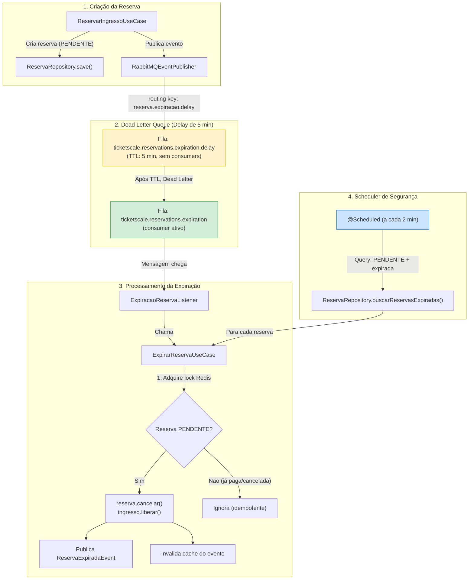

# 🕐 Plano de Implementação — Expiração Automática de Reservas

## Decisões de Design Consolidadas

| Decisão | Escolha |
|---|---|
| **Mecanismo primário** | RabbitMQ TTL nativo + Dead Letter Queue |
| **Delay** | 5 minutos (TTL na fila intermediária) |
| **Mecanismo de fallback** | `@Scheduled` a cada 2 minutos |
| **Infraestrutura existente** | Reaproveitar fila `ticketscale.reservations.expiration` + listener |
| **Ponto de disparo** | `ReservarIngressoUseCase` após criar a reserva |
| **Proteção de concorrência** | Lock distribuído via Redis (mesmo padrão do pagamento) |
| **Organização do código** | Use case dedicado `ExpirarReservaUseCase` |
| **Evento pós-expiração** | Novo `ReservaExpiradaEvent` |
| **Testes** | Unitários + integração com H2 |

---

## Arquitetura do Fluxo



---

## Etapas de Implementação

### Etapa 1 — Domínio: Evento `ReservaExpiradaEvent`

> **Arquivo a criar:** `src/main/java/com/ticketscale/domain/event/ReservaExpiradaEvent.java`

```java
public class ReservaExpiradaEvent {
    private final String reservaId;
    private final String ingressoId;
    private final String loteId;
    private final String usuarioId;
    // Construtor + Getters
}
```

---

### Etapa 2 — Domínio: Novo método no `ReservaRepository`

> **Arquivo a modificar:** [`ReservaRepository.java`](file:///home/luke/dev/workspace/github.com/lucianoparintins/ticket-scale/src/main/java/com/ticketscale/domain/reserva/ReservaRepository.java)

Adicionar método para buscar reservas pendentes expiradas (usado pelo scheduler de fallback):

```java
@Query("SELECT r FROM Reserva r JOIN FETCH r.ingresso i JOIN FETCH i.lote "
     + "WHERE r.status = 'PENDENTE' AND r.dataExpiracao < :agora")
List<Reserva> buscarReservasExpiradas(@Param("agora") LocalDateTime agora);
```

---

### Etapa 3 — Application: Porta `EventPublisher`

> **Arquivo a modificar:** [`EventPublisher.java`](file:///home/luke/dev/workspace/github.com/lucianoparintins/ticket-scale/src/main/java/com/ticketscale/application/port/out/EventPublisher.java)

Adicionar método para publicar evento de reserva expirada:

```java
void publicarReservaExpirada(ReservaExpiradaEvent evento);
```

---

### Etapa 4 — Application: `ExpirarReservaUseCase`

> **Arquivo a criar:** `src/main/java/com/ticketscale/application/usecase/ExpirarReservaUseCase.java`

Lógica central:
1. Adquirir lock distribuído: `lock:expiracao:reserva:{reservaId}`
2. Buscar reserva com fetch join (ingresso + lote)
3. Verificar se status é `PENDENTE` (idempotência)
4. Chamar `reserva.cancelar()` (altera status para CANCELADA e libera ingresso)
5. Salvar reserva
6. Invalidar cache do evento
7. Publicar `ReservaExpiradaEvent`
8. Liberar lock

> [!IMPORTANT]
> Usar a mesma chave de lock que o `ProcessarPagamentoUseCase` (`lock:pagamento:reserva:{reservaId}`) para garantir exclusão mútua entre expiração e pagamento.

---

### Etapa 5 — Infraestrutura: Configuração RabbitMQ (Dead Letter Queue)

> **Arquivo a modificar:** [`RabbitMQConfig.java`](file:///home/luke/dev/workspace/github.com/lucianoparintins/ticket-scale/src/main/java/com/ticketscale/infrastructure/config/RabbitMQConfig.java)

Adicionar:
- **Dead Letter Exchange** (pode reutilizar a exchange existente `ticketscale.events`)
- **Fila intermediária** `ticketscale.reservations.expiration.delay`:
  - `x-message-ttl`: 300000 (5 minutos em ms)
  - `x-dead-letter-exchange`: `ticketscale.events`
  - `x-dead-letter-routing-key`: `reserva.expiracao`
- **Nova routing key** `reserva.expiracao.delay` para a fila intermediária
- **Binding** da fila delay com a exchange

```java
public static final String QUEUE_RESERVATIONS_EXPIRATION_DELAY = "ticketscale.reservations.expiration.delay";
public static final String ROUTING_KEY_RESERVA_EXPIRACAO_DELAY = "reserva.expiracao.delay";

@Bean
public Queue reservationsExpirationDelayQueue() {
    return QueueBuilder.durable(QUEUE_RESERVATIONS_EXPIRATION_DELAY)
            .withArgument("x-message-ttl", 300_000) // 5 minutos
            .withArgument("x-dead-letter-exchange", EXCHANGE_TICKETSCALE_EVENTS)
            .withArgument("x-dead-letter-routing-key", ROUTING_KEY_RESERVA_EXPIRACAO)
            .build();
}
```

---

### Etapa 6 — Infraestrutura: Modificações

#### 6a. `RabbitMQEventPublisher`
> **Arquivo a modificar:** [`RabbitMQEventPublisher.java`](file:///home/luke/dev/workspace/github.com/lucianoparintins/ticket-scale/src/main/java/com/ticketscale/infrastructure/messaging/RabbitMQEventPublisher.java)

- Alterar `publicarReservaExpiracao()` para enviar para a **fila de delay** (routing key `reserva.expiracao.delay`)
- Implementar `publicarReservaExpirada()` para o novo evento

#### 6b. `ExpiracaoReservaListener`
> **Arquivo a modificar:** [`ExpiracaoReservaListener.java`](file:///home/luke/dev/workspace/github.com/lucianoparintins/ticket-scale/src/main/java/com/ticketscale/infrastructure/messaging/listener/ExpiracaoReservaListener.java)

- Injetar `ExpirarReservaUseCase`
- Implementar a lógica: extrair `reservaId` do evento e chamar `useCase.executar(reservaId)`

#### 6c. `ReservarIngressoUseCase`
> **Arquivo a modificar:** [`ReservarIngressoUseCase.java`](file:///home/luke/dev/workspace/github.com/lucianoparintins/ticket-scale/src/main/java/com/ticketscale/application/usecase/ReservarIngressoUseCase.java)

- Após salvar a reserva, publicar evento de expiração com delay:
  ```java
  eventPublisher.publicarReservaExpiracao(new ReservaCriadaEvent(...));
  ```

#### 6d. Scheduler de Fallback
> **Arquivo a criar:** `src/main/java/com/ticketscale/infrastructure/scheduler/ExpiracaoReservaScheduler.java`

```java
@Component
public class ExpiracaoReservaScheduler {

    private final ReservaRepository reservaRepository;
    private final ExpirarReservaUseCase expirarReservaUseCase;

    @Scheduled(fixedRate = 120_000) // A cada 2 minutos
    public void verificarReservasExpiradas() {
        List<Reserva> expiradas = reservaRepository
            .buscarReservasExpiradas(LocalDateTime.now());

        for (Reserva reserva : expiradas) {
            expirarReservaUseCase.executar(reserva.getId());
        }
    }
}
```

> [!NOTE]
> O `@EnableScheduling` precisa estar habilitado na aplicação (verificar se já existe na classe principal ou em alguma config).

---

### Etapa 7 — Testes

#### 7a. Unitário: `ExpirarReservaUseCaseTest`
> **Arquivo a criar:** `src/test/java/.../application/usecase/ExpirarReservaUseCaseTest.java`

Cenários:
- ✅ Deve expirar reserva PENDENTE e liberar ingresso
- ✅ Deve ignorar reserva já CONFIRMADA (idempotência)
- ✅ Deve ignorar reserva já CANCELADA (idempotência)
- ✅ Deve publicar `ReservaExpiradaEvent` após expirar
- ✅ Deve invalidar cache do evento
- ✅ Deve lançar exceção se não conseguir adquirir lock
- ✅ Deve liberar lock no finally

#### 7b. Unitário: `ExpiracaoReservaSchedulerTest`
> **Arquivo a criar:** `src/test/java/.../infrastructure/scheduler/ExpiracaoReservaSchedulerTest.java`

Cenários:
- ✅ Deve buscar e expirar todas as reservas pendentes vencidas
- ✅ Deve continuar processando mesmo se uma reserva falhar

#### 7c. Integração: `ExpirarReservaIntegrationTest`
> **Arquivo a criar:** `src/test/java/.../ExpirarReservaIntegrationTest.java`

Cenários:
- ✅ Fluxo completo: criar reserva → expirar → ingresso volta para LIVRE
- ✅ Reserva confirmada não é afetada pela expiração

---

### Etapa 8 — Documentação

- Atualizar `CHANGELOG.md` com a nova versão
- Atualizar `README.md` com a feature no roadmap
- Atualizar `GEMINI.md` se necessário

---

## Arquivos Resumo

| Ação | Arquivo |
|---|---|
| 🆕 Criar | `domain/event/ReservaExpiradaEvent.java` |
| 🆕 Criar | `application/usecase/ExpirarReservaUseCase.java` |
| 🆕 Criar | `infrastructure/scheduler/ExpiracaoReservaScheduler.java` |
| 🆕 Criar | `test/.../ExpirarReservaUseCaseTest.java` |
| 🆕 Criar | `test/.../ExpiracaoReservaSchedulerTest.java` |
| 🆕 Criar | `test/.../ExpirarReservaIntegrationTest.java` |
| ✏️ Modificar | `domain/reserva/ReservaRepository.java` (query de expiradas) |
| ✏️ Modificar | `application/port/out/EventPublisher.java` (novo método) |
| ✏️ Modificar | `application/usecase/ReservarIngressoUseCase.java` (publicar evento) |
| ✏️ Modificar | `infrastructure/config/RabbitMQConfig.java` (DLQ + delay queue) |
| ✏️ Modificar | `infrastructure/messaging/RabbitMQEventPublisher.java` (routing key delay) |
| ✏️ Modificar | `infrastructure/messaging/listener/ExpiracaoReservaListener.java` (chamar use case) |
| ✏️ Modificar | `CHANGELOG.md`, `README.md` |
